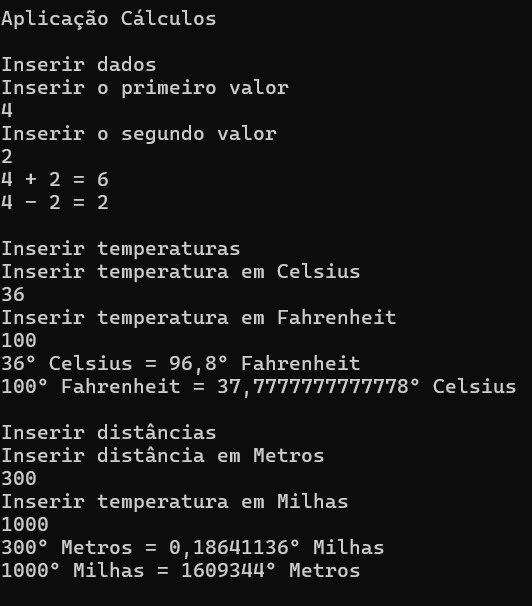

# Cálculos :1234:
 Aplicação em C# para efetuar diversos tipos de cálculos.

 

A aplicação foi desenvolvida no âmbito da ação de formação **Introdução ao Git e GitHub**

## Operações suportadas
Neste momento esta aplicação implementa as seguintes operações:
- Aritméticas
    - soma
    - Subtração
    - Multiplicação
- Conversões
    - Temperatura
        - Celsius :arrow_right: Fahrenheit
        - Fahrenheit :arrow_right: Celsius 
    - Distâncias
        - Metros :arrow_right: Milhas
        - Milhas :arrow_right: Metros 

## Tecnologias utilizadas neste projeto
- Visual Studio
- C#
- Git
- GitHub Desktop
- Plataforma GitHub

